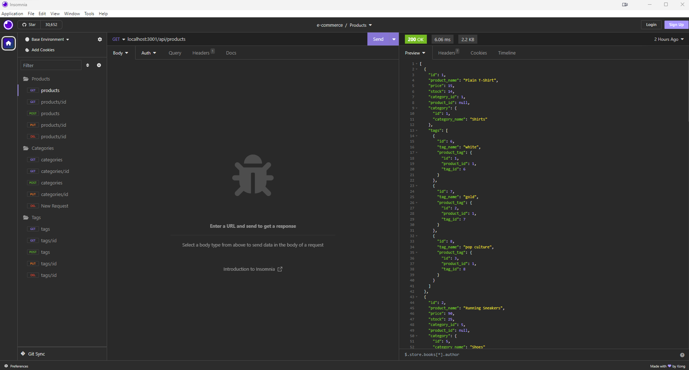

# E-Commerce Backend

## e-commerce-backend

## Description

This application uses MySQL, Sequelize, and Express to create an API interface to manage Products, Categories, and Tags for an e-commerce marketplace. This has no front end so interactions will take place within either Postman or Insomnia to view, update, create, and delete data.

## Table of Contents

- [Installation](#installation)
- [Usage](#usage)
- [Contribution](#contribution)
- [Tests](#tests)
- [License](#license)
- [Questions](#questions)

## Installation

Simply run "npm i" to install all necessary dependencies. You must have MySQL installed on your local machine as well as Insomnia or Postman to interact with the various endpoints. This also utilizes a "dotenv" file for db connection management.

## Usage

Utilize your API call program of choice (I used Insomnia) once the installation is complete to interact with the various endpoints and start managing your data.

## Contribution

N/A

## Tests

N/A

## License

None

## Questions

You can reach me at danielwatkins@byu.net or find me at https://github.com/dan-watkins
